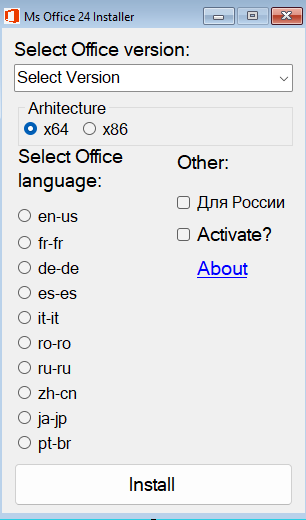

MS Office 24 Installer
======================

##### Overview

The MS Office 24 Installer is a Windows Forms application designed to automate the installation process of Microsoft Office versions (2024, 2021, 2019, and 2016) with customizable architecture (x64 or x86) and language settings.

### Features

* Select from multiple Office versions: 2024, 2021, 2019, and 2016.
* Choose between 32-bit (x86) or 64-bit (x64) architecture.
* Support for multiple languages including English, French, German, Spanish, Italian, Romanian, Russian, Chinese, Japanese, and Portuguese.
* Automatically generates a `config.xml` file based on user selections.
* Optional activation script execution.
* Displays a secondary "About" window for additional information.

Screenshots
-----------

## Installation

1. Ensure the required Office installation files (`setup.exe`) and resources are present in the `res` directory.
2. Compile and run the application using a compatible .NET environment.
3. Follow the on-screen instructions to select the desired version, architecture, and language.

Usage
-----

1. Launch the application.
2. Use the dropdown menu to select the Office version.
3. Check the appropriate radio button for the architecture (x64 or x86).
4. Select the preferred language from the available options.
5. Optionally check the boxes for activation or country code settings.
6. Click the "Install" button to initiate the installation process.

Notes
-----

* Administrator privileges are required for certain operations (e.g., registry edits and activation scripts).
* The application uses PowerShell scripts for additional configuration and activation tasks.
* Ensure the `res` directory contains the necessary setup files before running the installer.
